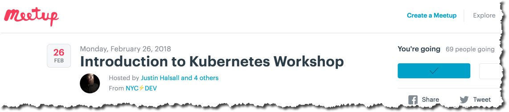

**Session Objective:**  introduction to containers and Kubernetes. Overview of the "what" and "why" of Docker containers and an overview of container orchestration with Kubernetes. In addition to lecture and discussion will be some hands on labs to demonstrate how to install the required tools and see how containers work in practice. Attending this session will give you the basic skills to explore and experiment with containers to determine how they best fit your use cases, or just to have fun with them!

**Proposed Duration**: 2hrs including ~30 minutes of presentation and ~90 minutes of hands on exercises

---

### Agenda Overview

**Presentation and Discussion**

In this segment we'll spend about 30 minutes talking through the basics:
- What are "containers" and where did they come from?
- What's the difference between containers and Virtual machines?
- What's "container orchestration" and what's [Kubernetes](https://kubernetes.io/) all about?

**10 minute break**

**Exercises**

- [lab 00](lab00/README.md): Creating a working environment
- [lab 01](lab01/README.md): Running your first docker container
- [lab 02](lab02/README.md): Building your own docker container

**Getting Started with Minikube**

- [lab 03](lab03/README.md): Running Kubernetes with minikube
- [lab 04](lab04/README.md): Deploying a container to minikube

**Deploying an application on minikube**

- [lab 05](lab05/README.md): Containerize and deploy a node.js application
- [lab 06](lab06/README.md): Deploy a multi-container application

**Questions?**

---
