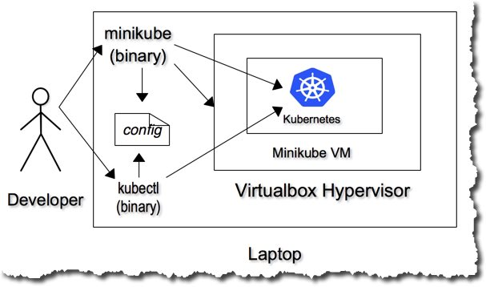

## Getting familiar with Minikube

In this section get a little familiar with Minikube by looking around the environment.

Minikube is our local, single node installation of Kubernetes... its great for our purposes, which is to learn more about how Kubernetes works without getting to distracted by the details of setting up a multi-node cluster.




Now we're ready to take a closer look at minikube. Typing "minikube" at the prompt returns the usage statement. First we'll start minikube which will boot the virtual machine that runs Kubernetes.

```
$ minikube start
Starting local Kubernetes v1.8.0 cluster...
Starting VM...
Getting VM IP address...
Moving files into cluster...
Setting up certs...
Connecting to cluster...
Setting up kubeconfig...
Starting cluster components...
Kubectl is now configured to use the cluster.
Loading cached images from config file.

```

Now that our one node Kubernetes cluster is up and running, we can explore a little... lets start by checking the status of our cluster.

```
$ minikube status
minikube: Running
cluster: Running
kubectl: Correctly Configured: pointing to minikube-vm at 192.168.99.100

```

Between minikube and kubectl we can look around at our environment. Run 'minikube' and 'kubectl' and take a look at the usage statement to see what the key commands are.

Then lets interrogate the cluster... though a kubernetes cluster likely has multiple nodes, minikube is a single node cluster that's helpful for development and testing.

```

$ kubectl get nodes
NAME       STATUS    ROLES     AGE       VERSION
minikube   Ready     <none>    2h        v1.8.0


```

We can check if there's a more updated version of minikube:

```
$ minikube update-check
CurrentVersion: v0.24.1
LatestVersion: v0.25.0
```

We can also see what pods are running using kubectl. We haven't run any pods yet, but there are some system pods we can take a look at...

```
$ kubectl get pods --all-namespaces
NAMESPACE     NAME                          READY     STATUS    RESTARTS   AGE
kube-system   kube-addon-manager-minikube   1/1       Running   0          4h
kube-system   kube-dns-86f6f55dd5-hdzsm     3/3       Running   0          4h
kube-system   kubernetes-dashboard-df52s    1/1       Running   0          4h
kube-system   storage-provisioner           1/1       Running   0          4h
```
---
